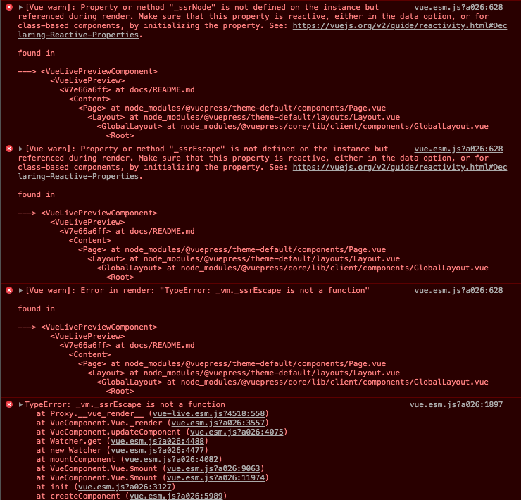

# Vue Live List Error

We seem to have a problem rendering lists inside `vue-live` (specifically
`vuepress-vue-live` but seems to affect both). Not totally sure if it is
isolated to lists or if there are other issues too. Vue live itself seems
to work. This is a fresh install of vuepress and vuepress-plugin-live.
And it works:

```vue live
<button v-text="`Live button`" />
```
But if we have a simple list component:

#### List.vue
```vue
<template>
  <ul>
    <li
      v-for="(value, key) in items"
      :key="key"
    >
     {{ key }}: {{ value }}
    </li>
  </ul>
</template>

<script>
export default {
  props: {
    items: {
      type: Object,
      required: true
    }
  }
}
</script>
```

It works when rendering our `List` component directly on the page.

<List
:items="{pizza: 'Pepperoni', flavor: 'Chocolate'}"
/>

But fails when running inside Vue live. This has something to do with the
`v-for` but I don't fully understand what 🤷‍. This used to work with vue-live
`1.8.1`. 

```vue live
<List
  :items="{pizza: 'Pepperoni', flavor: 'Chocolate'}"
/>
```
If you check the console, there is a big ol' nasty message about ssr missing.

Of note, if you manually set vue-live to `1.9.1` you get an error
message in the live window:

```
Cannot parse template expression: {pizza: 'Pepperoni', flavor: 'Chocolate'}
Unexpected token (1:34)
```

